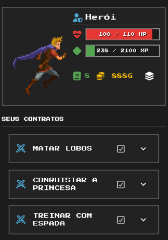

⚔️ DailyRPG 🛡️
Transforme suas tarefas diárias em uma aventura épica.
Sobre | Funcionalidades | Instalação

📜 Sobre a Aventura
DailyRPG não é apenas um gerenciador de tarefas; é o seu companheiro de batalha contra o monstro da procrastinação. Neste aplicativo, sua vida se torna um RPG onde cada tarefa concluída é um monstro derrotado, garantindo XP (Experiência) para subir de nível e Gold (Ouro) para comprar recompensas e aprimorar seu herói.

Você é o herói da sua própria história. Seus hábitos ruins tiram sua vida (HP), enquanto seus bons hábitos o tornam lendário.

📸 Grimório Visual (Screenshots)
Conheça as terras de DailyRPG, tela por tela:

<h2>HOME</h2>

O Centro de Comando: Aqui você visualiza o status atual do seu herói (HP e XP) e o seu saldo de Ouro. Logo abaixo, sua lista de contratos ativos (tarefas) espera por ação. É o ponto de partida da sua jornada diária.

<h2>CONTRATOS</h2>

Assinando Missões: Nesta tela você cria novas tarefas. Defina o título da missão, os detalhes e, o mais importante, a dificuldade. Tarefas mais difíceis oferecem maiores recompensas em Ouro e Experiência.

<h2>⚔️ Campo de Batalha</h2>

O Combate: A representação visual da sua luta contra a procrastinação. Ao completar tarefas na vida real, seu herói ataca o inimigo na tela. Se deixar tarefas vencerem, é você quem sofre o dano.

<h2>💰 A Loja do Caçador</h2>

Recompensas: Use o Ouro que você ganhou com seu suor para comprar equipamentos que melhoram seus atributos no jogo, ou compre "Recompensas Reais" que você mesmo define (como "Tirar uma folga" ou "Comprar um lanche").

<h2>🐉 A Toca do Chefe</h2>

Chefão: A representação visual da sua luta contra a procrastinação. Ao completar tarefas na vida real, seu herói ataca o Boss. Se deixar tarefas vencerem, é você quem sofre o dano.

🎒 Arsenal de Funcionalidades
🗡️ Sistema de Contratos (Gerenciamento de Tasks)
Criação de Missões: Adicione tarefas diárias, to-dos.

Classificação de Dificuldade: Tarefas mais difíceis dão mais recompensas (XP e Gold).

Checklist de Batalha: Marque tarefas como concluídas para atacar o Boss e ganhar materiais.

🛡️ Inventário e Equipamentos
Gestão de Itens: Visualize e gerencie todas as armas, armaduras e poções adquiridas na loja ou em drops de chefes.

Equipar Personagem: Troque seus equipamentos para alterar o visual do seu avatar e melhorar atributos específicos.

🧙‍♂️ Evolução de Personagem
Barra de HP: Se você falhar em suas tarefas diárias ou mantiver hábitos ruins, você perde vida.

Barra de XP: Suba de nível completando tarefas e desbloqueie novos recursos.

Atributos: Aumente sua Força, Inteligência e Disciplina baseada no tipo de tarefa realizada.

🏰 Economia e Loja
Gold System: Ganhe moedas ao ser produtivo.

Loja Personalizável: Compre itens no jogo (armaduras, espadas) ou crie recompensas personalizadas para você mesmo.

🛠️ Forja e Ferramentas (Tecnologias)
Este projeto foi forjado com as seguintes tecnologias arcanas:

Linguagem: [C#/Dart]

Framework: [Asp.NET/Flutter]

Backend/Banco de Dados: [MySQL]

Pixel Art: Não é original, todos os direitos reservados aos autores originais das imagens usadas no aplicativo.

🚀 Iniciando a Jornada (Instalação)

==FuturoPage==

🤝 Junte-se à Guilda (Contribuição)
Aventureiros de todos os reinos são bem-vindos! Se você deseja contribuir com código, arte ou ideias:

Faça um Fork do projeto.

Crie uma Branch para sua Feature (git checkout -b feature/NovaEspada).

Commit suas mudanças (git commit -m 'Adiciona nova espada lendária').

Push para a Branch (git push origin feature/NovaEspada).

Abra um Pull Request.

📜 Licença
Este projeto está sob a licença MIT - veja o arquivo LICENSE para detalhes.

Feito com ⚔️ e ☕ por [Arthur Alexandre]

A aventura continua...

